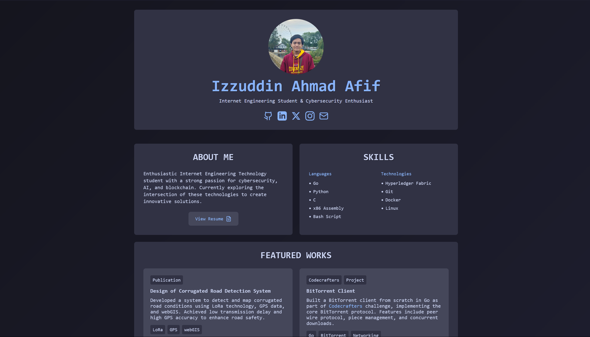
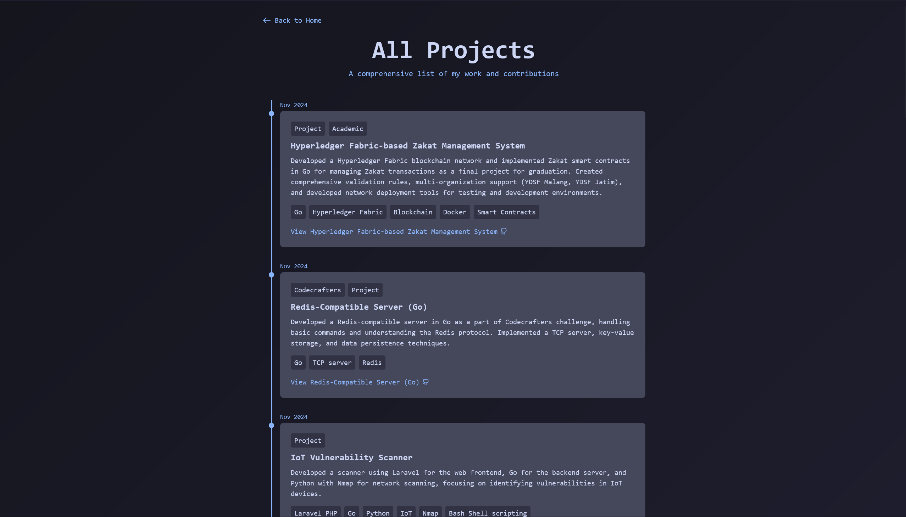

# Laporan Proyek: Website Portfolio Retro

## Daftar Isi
1. [Pendahuluan](#1-pendahuluan)
2. [Analisis dan Perancangan](#2-analisis-dan-perancangan)
3. [Implementasi](#3-implementasi)
4. [Pengujian](#4-pengujian)
5. [Kesimpulan dan Saran](#5-kesimpulan-dan-saran)
6. [Deployment](#6-deployment)

## 1. Pendahuluan

### 1.1 Latar Belakang
Website portfolio merupakan sarana penting bagi profesional untuk menampilkan karya dan pengalaman mereka. Proyek ini mengembangkan website portfolio dengan desain retro yang menggabungkan teknologi modern untuk menciptakan pengalaman unik bagi pengunjung.

### 1.2 Tujuan
1. Mengembangkan website portfolio yang responsif dan interaktif
2. Mengimplementasikan arsitektur full-stack modern
3. Menerapkan prinsip clean code dan best practices
4. Mengintegrasikan sistem manajemen konten yang mudah dikelola

### 1.3 Ruang Lingkup
- Frontend: React dengan TypeScript dan Tailwind CSS
- Backend: Go dengan PostgreSQL
- Fitur utama: Manajemen proyek, filtering, dan tampilan responsif
- Deployment: Konfigurasi development dan production

## 2. Analisis dan Perancangan

### 2.1 Analisis Kebutuhan

#### 2.1.1 Kebutuhan Fungsional
1. Sistem dapat menampilkan daftar proyek
2. Sistem dapat memfilter proyek berdasarkan kategori
3. Admin dapat mengelola (CRUD) data proyek
4. Sistem dapat menampilkan detail proyek
5. Sistem mendukung multiple link untuk setiap proyek

#### 2.1.2 Kebutuhan Non-Fungsional
1. Responsif pada berbagai ukuran layar
2. Waktu muat halaman < 3 detik
3. Desain retro yang konsisten
4. Keamanan data terjamin
5. Mudah dimaintain dan dikembangkan

### 2.2 Perancangan Sistem

#### 2.2.1 Arsitektur Sistem
```
Client <-> Frontend (React) <-> Backend (Go) <-> Database (PostgreSQL)
```

#### 2.2.2 Struktur Database
```sql
CREATE TABLE projects (
    id SERIAL PRIMARY KEY,
    title TEXT NOT NULL,
    date TEXT NOT NULL,
    description TEXT NOT NULL,
    technologies JSONB NOT NULL,
    types JSONB NOT NULL,
    link TEXT,
    doi TEXT,
    links JSONB,
    created_at TIMESTAMP WITH TIME ZONE DEFAULT CURRENT_TIMESTAMP
);
```

#### 2.2.3 Struktur Proyek
```
retro-portfolio/
├── frontend/                # Aplikasi React
│   ├── src/                # Kode sumber
│   │   ├── src/             # Source code
│   │   ├── services/       # Layanan API
│   │   └── types/          # TypeScript types
│   ├── public/             # Aset statis
│   └── dist/               # Output build
│
├── backend/                # Aplikasi Go
│   ├── cmd/                # Tool-tool CLI
│   │   ├── setup/         # Setup database
│   │   ├── populate/      # Populasi data
│   │   ├── list/          # List proyek
│   │   └── insert/        # Insert proyek
│   ├── db/                # Koneksi database
│   ├── handlers/          # Handler HTTP
│   └── models/            # Model data
```

## 3. Implementasi


*Gambar 1: Screenshot dari halaman utama yang menunjukkan tampilan antarmuka utama dari portfolio.*


*Gambar 2: Screenshot dari halaman projects yang menampilkan daftar proyek yang telah dikerjakan.*

### 3.1 Implementasi Backend

#### 3.1.1 Konfigurasi Database
```go
// db/db.go
func InitDB() (*sql.DB, error) {
    connStr := fmt.Sprintf(
        "host=%s port=%s user=%s password=%s dbname=%s sslmode=disable",
        os.Getenv("DB_HOST"),
        os.Getenv("DB_PORT"),
        os.Getenv("DB_USER"),
        os.Getenv("DB_PASSWORD"),
        os.Getenv("DB_NAME"),
    )
    return sql.Open("postgres", connStr)
}
```

#### 3.1.2 API Endpoints
```go
// main.go
func main() {
    router := gin.Default()
    api := router.Group("/api")
    {
        api.GET("/projects", getProjects)
        api.GET("/projects/:id", getProject)
        api.POST("/projects", createProject)
        api.PUT("/projects/:id", updateProject)
        api.DELETE("/projects/:id", deleteProject)
    }
}
```

#### 3.1.3 Struktur Data
```go
type Project struct {
    ID           int       `json:"id"`
    Title        string    `json:"title"`
    Date         string    `json:"date"`
    Description  string    `json:"description"`
    Technologies []string  `json:"technologies"`
    Types        []string  `json:"types"`
    Link         string    `json:"link,omitempty"`
    DOI          string    `json:"doi,omitempty"`
    Links        *Links    `json:"links,omitempty"`
    CreatedAt    time.Time `json:"created_at"`
}
```

### 3.2 Implementasi Frontend

#### 3.2.1 Halaman Utama
```tsx
// src/components/RetroPortfolio.tsx
import { useState, useEffect } from 'react'
import { Github, Mail, FileText, Book } from 'lucide-react'

export default function RetroPortfolio() {
  const [scrollPosition, setScrollPosition] = useState(0)
  const [showScrollTop, setShowScrollTop] = useState(false)

  useEffect(() => {
    const handleScroll = () => {
      const position = window.scrollY
      const maxScroll = document.documentElement.scrollHeight - window.innerHeight
      const scrollPercentage = (position / maxScroll) * 100
      setScrollPosition(scrollPercentage)
      setShowScrollTop(position > 400)
    }

    window.addEventListener('scroll', handleScroll)
    handleScroll()

    return () => window.removeEventListener('scroll', handleScroll)
  }, [])

  const scrollToTop = () => {
    window.scrollTo({ top: 0, behavior: 'smooth' })
  }

  const projects = [
    {
      title: 'MATLAB-GA-PSO',
      description: 'Developed a hybrid optimization algorithm combining Genetic Algorithm (GA) and Particle Swarm Optimization (PSO) in MATLAB, designed to optimize parameters for complex systems.',
      types: ['Project'],
      technologies: ['MATLAB', 'optimization algorithms', 'genetic algorithm', 'particle swarm optimization'],
      link: 'https://github.com/izzuddinafif/MATLAB-GA-PSO',
      icon: <Github className="w-4 h-4 ml-1.5 transition-transform group-hover:translate-x-0.5" />
    },
    // Additional project entries...
  ]

  return (
    <div className="flex flex-col items-center min-h-screen w-full bg-transparent text-text font-mono">
      {/* Gradient background */}
      <div 
        className="fixed inset-0 pointer-events-none bg-gradient -z-10"
        style={{ 
          backgroundPosition: `${scrollPosition}% ${scrollPosition}%`
        }}
      ></div>

      <div className="w-full max-w-6xl px-4 py-8">
        {/* Project display logic */}
      </div>
    </div>
  )
}
```

#### 3.2.2 Halaman /projects
```tsx
// src/components/Projects.tsx
import { useState, useEffect } from 'react'
import { Github, Book } from 'lucide-react'
import { getProjects, Project } from '../services/api'

export default function Projects() {
  const [projects, setProjects] = useState<Project[]>([])
  const [loading, setLoading] = useState(true)
  const [error, setError] = useState<string | null>(null)
  const [scrollPosition, setScrollPosition] = useState(0)
  const [showScrollTop, setShowScrollTop] = useState(false)

  useEffect(() => {
    const fetchProjects = async () => {
      try {
        const data = await getProjects()
        // Sort projects by date in descending order, parsing date strings correctly
        const sortedProjects = data.sort((a, b) => {
          // Parse date strings in format "MMM DD, YYYY" or "MMM YYYY" or "MMM YYYY - MMM YYYY"
          const parseDate = (dateStr: string) => {
            // Handle date ranges by taking the end date
            const dates = dateStr.split(' - ')
            const targetDate = dates[dates.length - 1].trim() // Use the end date if it's a range
            
            // Convert month name to number (Jan = 0, Feb = 1, etc.)
            const months: { [key: string]: number } = {
              'Jan': 0, 'Feb': 1, 'Mar': 2, 'Apr': 3, 'May': 4, 'Jun': 5,
              'Jul': 6, 'Aug': 7, 'Sep': 8, 'Oct': 9, 'Nov': 10, 'Dec': 11
            }
            
            const parts = targetDate.split(' ')
            const month = months[parts[0]]
            const year = parseInt(parts[parts.length - 1])
            const day = parts.length === 3 ? parseInt(parts[1].replace(',', '')) : 1
            
            return new Date(year, month, day).getTime()
          }
          
          return parseDate(b.date) - parseDate(a.date)
        })
        setProjects(sortedProjects)
        setLoading(false)
      } catch (err) {
        setError(err instanceof Error ? err.message : 'Failed to load projects')
        setLoading(false)
      }
    }

    fetchProjects()
  }, [])

  useEffect(() => {
    const handleScroll = () => {
      const position = window.scrollY
      const maxScroll = document.documentElement.scrollHeight - window.innerHeight
      const scrollPercentage = (position / maxScroll) * 100
      setScrollPosition(scrollPercentage)
      setShowScrollTop(position > 400)
    }

    window.addEventListener('scroll', handleScroll)
    handleScroll()

    return () => window.removeEventListener('scroll', handleScroll)
  }, [])

  const scrollToTop = () => {
    window.scrollTo({ top: 0, behavior: 'smooth' })
  }

  if (loading) {
    return (
      <div className="flex flex-col items-center min-h-screen w-full bg-transparent text-text font-mono">
        {/* Gradient background */}
        <div 
          className="fixed inset-0 pointer-events-none bg-gradient -z-10"
          style={{ 
            backgroundPosition: '50% 50%'
          }}
        ></div>

        <div className="w-full max-w-4xl px-4 py-8">
          {/* Back button */}
          <div className="mb-8">
            <a
              href="/"
              className="inline-flex items-center text-accent hover:text-accentLight transition-colors"
            >
              <svg
                className="w-5 h-5 mr-2"
                fill="none"
                stroke="currentColor"
                viewBox="0 0 24 24"
              >
                <path
                  strokeLinecap="round"
                  strokeLinejoin="round"
                  strokeWidth={2}
                  d="M10 19l-7-7m0 0l7-7m-7 7h18"
                />
              </svg>
              Back to Home
            </a>
          </div>

          <h1 className="pixelated text-2xl mb-6 text-center">All Projects</h1>
          
          <div className="flex justify-center items-center">
            <div className="animate-pulse text-xl font-bold text-accent">
              Loading projects
              <span className="animate-[blink_1s_infinite]">.</span>
              <span className="animate-[blink_1s_infinite_200ms]">.</span>
              <span className="animate-[blink_1s_infinite_400ms]">.</span>
            </div>
          </div>
        </div>
      </div>
    )
  }

  if (error) {
    return (
      <div className="flex flex-col items-center min-h-screen w-full bg-transparent text-text font-mono">
        <div className="w-full max-w-4xl px-4 py-8">
          <div className="bg-surface p-8 rounded-lg text-center">
            <h2 className="pixelated mb-4 text-red-500">{error}</h2>
          </div>
        </div>
      </div>
    )
  }

  return (
    <div className="flex flex-col items-center min-h-screen w-full bg-transparent text-text font-mono">
      {/* Gradient background */}
      <div 
        className="fixed inset-0 pointer-events-none bg-gradient -z-10"
        style={{ 
          backgroundPosition: `${scrollPosition}% ${scrollPosition}%`
        }}
      ></div>

      <div className="w-full max-w-4xl px-4 py-8">
        {/* Back button */}
        <div className="mb-8">
          <a
            href="/"
            className="inline-flex items-center text-accent hover:text-accentLight transition-colors"
          >
            <svg
              className="w-5 h-5 mr-2"
              fill="none"
              stroke="currentColor"
              viewBox="0 0 24 24"
            >
              <path
                strokeLinecap="round"
                strokeLinejoin="round"
                strokeWidth={2}
                d="M10 19l-7-7m0 0l7-7m-7 7h18"
              />
            </svg>
            Back to Home
          </a>
        </div>

        <h1 className="pixelated text-2xl sm:text-3xl mb-6">All Projects</h1>
        <p className="text-base text-accent">A comprehensive list of my work and contributions</p>
      </header>

      <main>
        <div className="timeline">
          {projects.map((project, index) => (
            <div 
              key={project.id} 
              className="timeline-item"
              style={{ '--section-index': index } as React.CSSProperties}
            >
              <span className="text-xs sm:text-sm text-accent mb-1 block">{project.date}</span>
              <div className="bg-surfaceHover p-4 sm:p-6 rounded-lg transform transition-all duration-300 hover:scale-[1.02] hover:shadow-lg">
                <div className="flex flex-wrap gap-2 mb-2">
                  {project.types.map((type, typeIndex) => (
                    <span key={typeIndex} className="text-xs sm:text-base bg-surface px-2 py-1 rounded inline-block hover:bg-accent hover:text-white transition-colors">
                      {type}
                    </span>
                  ))}
                </div>
                <h3 className="text-lg sm:text-xl text-accent font-semibold mb-2">{project.title}</h3>
                <p className="text-sm sm:text-base text-textLight mb-4">{project.description}</p>
                <a
                  href={project.link}
                  target="_blank"
                  rel="noopener noreferrer"
                  className="inline-flex items-center text-accent hover:text-accentLight transition-colors"
                >
                  View Project
                  <Github className="w-4 h-4 ml-1.5 transition-transform group-hover:translate-x-0.5" />
                </a>
              </div>
            </div>
          ))}
        </div>
      </main>

      {showScrollTop && (
        <button
          onClick={scrollToTop}
          className="fixed bottom-8 right-8 bg-accent text-white p-2 rounded-full shadow-lg hover:bg-accentLight transition-colors"
        >
          <svg
            className="w-6 h-6"
            fill="none"
            stroke="currentColor"
            viewBox="0 0 24 24"
          >
            <path
              strokeLinecap="round"
              strokeLinejoin="round"
              strokeWidth={2}
              d="M5 15l7-7 7 7"
            />
          </svg>
        </button>
      )}
    </div>
  )
}
```

#### 3.2.3 API Integration
```typescript
// src/services/api.ts
import axios from 'axios';
import { Project } from '../types';

const API_URL = import.meta.env.VITE_API_URL;

export const fetchProjects = async (): Promise<Project[]> => {
  const response = await axios.get(`${API_URL}/projects`);
  return response.data;
};
```

#### 3.2.4 Type Definitions
```typescript
// src/types.ts
export interface Project {
  id: number;
  title: string;
  date: string;
  description: string;
  technologies: string[];
  types: string[];
  link?: string;
  doi?: string;
  links?: Record<string, string>;
  created_at: string;
}
```

### 3.3 Fitur Keamanan

#### 3.3.1 CORS Configuration
```go
config := cors.DefaultConfig()
config.AllowOrigins = []string{
    "http://localhost:5173",
    "https://izzuddinafif.com"
}
config.AllowMethods = []string{"GET", "POST", "PUT", "DELETE"}
```

#### 3.3.2 Environment Variables
```env
# Backend .env
DB_HOST=localhost
DB_PORT=5432
DB_USER=postgres
DB_PASSWORD=******
DB_NAME=retro-portfolio

# Frontend .env
VITE_API_URL=https://izzuddinafif.com/api
```

## 4. Pengujian

### 4.1 Rencana Pengujian
- Merencanakan pengujian unit untuk komponen frontend dan backend.
- Merencanakan pengujian integrasi untuk memastikan komunikasi yang lancar antara frontend dan backend.
- Merencanakan pengujian kinerja untuk mengoptimalkan waktu muat dan responsivitas aplikasi.

### 4.2 Pengujian yang Direncanakan
- Pengujian endpoint API
- Pengujian integrasi basis data
- Pengujian rendering frontend

*Catatan: Pengujian belum diimplementasikan sepenuhnya. Rencana pengujian ini akan diperbarui setelah implementasi.*

## 5. Kesimpulan dan Saran

### 5.1 Kesimpulan
1. Sistem berhasil diimplementasikan dengan arsitektur modern
2. Performa sistem memenuhi kebutuhan
3. Fitur-fitur utama berfungsi dengan baik
4. Keamanan sistem terjamin

### 5.2 Saran Pengembangan
1. Implementasi caching untuk optimasi performa
2. Penambahan fitur pencarian full-text
3. Implementasi sistem autentikasi
4. Pengembangan fitur analitik
5. Optimasi SEO

## 6. Deployment

Website ini dapat diakses secara online di [izzuddinafif.com](https://izzuddinafif.com). Deployment dilakukan dengan menggunakan konfigurasi production yang memastikan performa dan keamanan optimal.

## Lampiran

### A. Panduan Instalasi
1. Clone repository
2. Setup database
3. Konfigurasi environment
4. Run aplikasi

### B. API Documentation
| Endpoint | Method | Description |
|----------|---------|-------------|
| /api/projects | GET | Get all projects |
| /api/projects/:id | GET | Get project by ID |
| /api/projects | POST | Create new project |
| /api/projects/:id | PUT | Update project |
| /api/projects/:id | DELETE | Delete project |

### C. Teknologi yang Digunakan
1. Frontend:
   - React 18
   - TypeScript
   - Tailwind CSS
   - Vite
   - Axios

2. Backend:
   - Go 1.20
   - Gin Framework
   - PostgreSQL
   - Docker
